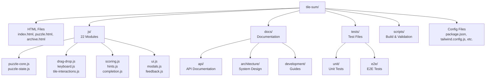

# Sum Tile - Daily Word Puzzle

A daily puzzle site hosted on GitHub Pages featuring a new word puzzle challenge every day. Each puzzle is an anagram game where players arrange letter tiles to form two words, with Scrabble scoring.

**Live Site**: [https://sum-tile.uk](https://sum-tile.uk)

## 🚀 Quick Start

**New to the project?** Start here:
1. **[Getting Started Guide](./docs/development/getting-started.md)** - Set up your development environment
2. **[Architecture Overview](./docs/architecture/overview.md)** - Understand the system design
3. **[Documentation Index](./docs/README.md)** - Complete documentation navigation

**Want to contribute?** See:
- **[Contributing Guide](./CONTRIBUTING.md)** - How to contribute
- **[Development Workflow](./docs/development/workflow.md)** - Development practices
- **[Code Style Guide](./docs/development/code-style.md)** - Coding standards

**Looking for API docs?** See:
- **[API Documentation](./docs/api/)** - Module reference
- **[Module Interactions](./docs/architecture/module-interactions.md)** - How modules work together
- **[Data Structures](./docs/architecture/data-structures.md)** - Data format specifications

## Quick Start

- **Edit puzzle data**: Edit `puzzle-data.js`, then run `npm run build:data`
- **Build for production**: Run `npm run build:all` (builds CSS + encoded puzzle data)
- **Local development**: Run `npm run build:all`, then start a local server

## Features

- **Daily Puzzle Homepage**: Shows today's puzzle automatically
- **Daily Puzzles**: Anagram puzzles where players arrange scrambled letter tiles to form two words
- **Archive Page**: Browse and play past puzzles
- **Scrabble Scoring**: Each tile displays its letter and Scrabble point value
- **Drag and Drop**: Intuitive tile placement with drag-and-drop or click-to-move functionality
- **Keyboard Navigation**: Full keyboard accessibility with arrow keys and tab navigation
- **Hints System**: Get hints to help solve puzzles
- **Solution Validation**: Submit button checks if the solution is correct
- **Completion Tracking**: Local storage tracks completed puzzles
- **Accessible Design**: Clean, modern UI with proper ARIA labels and keyboard navigation
- **Responsive Layout**: Works on desktop, tablet, and mobile devices

## Technology Stack

- **Frontend**: Vanilla HTML, CSS, JavaScript (ES6+ modules)
- **Styling**: Tailwind CSS 3.4.13 (compiled with PostCSS)
- **Build Tool**: PostCSS with Autoprefixer
- **Deployment**: GitHub Pages (static site)
- **Custom Domain**: sum-tile.uk

## Getting Started

### Prerequisites

- Node.js (v14 or higher) and npm
- Git

### Local Development Setup

1. **Clone this repository:**
   ```bash
   git clone https://github.com/YOUR_USERNAME/tile-sum.git
   cd tile-sum
   ```

2. **Install dependencies:**
   ```bash
   npm install
   ```

3. **Build assets:**
   ```bash
   npm run build:all
   ```
   This compiles Tailwind CSS from `src/styles.css` to `styles.css` and generates the encoded puzzle data file.
   
   For development, you can build them separately:
   ```bash
   npm run build:css  # Build CSS only
   npm run build:data # Build encoded puzzle data only
   ```

4. **Start a local server:**
   ```bash
   # Using Python 3
   python3 -m http.server 8000
   
   # Using Node.js (if you have http-server installed)
   npx http-server
   
   # Using PHP
   php -S localhost:8000
   ```

5. **Open in browser:**
   Navigate to `http://localhost:8000` in your browser.

**Note:** If you make changes to HTML files that add or modify Tailwind classes, rebuild the CSS with `npm run build:css`. For development, you can use `npm run watch:css` to automatically rebuild on changes.

## Project Structure

```
tile-sum/
├── index.html              # Home page with daily puzzle
├── puzzle.html             # Puzzle page
├── archive.html            # Archive page for accessing past puzzles
├── puzzle-data.js          # Puzzle definitions and Scrabble scores (source)
├── puzzle-data-encoded.js  # Encoded puzzle data (generated)
├── script.js               # Main entry point - imports and wires together all modules
├── styles.css              # Compiled Tailwind CSS (generated from src/styles.css)
│
├── js/                     # Modular JavaScript files
│   ├── archive.js          # Archive page functionality
│   ├── auto-complete.js    # Auto-complete feature
│   ├── completion.js       # Puzzle completion tracking
│   ├── drag-drop.js        # Drag and drop (re-exports)
│   ├── feedback.js         # User feedback and animations
│   ├── hints.js            # Hint system
│   ├── interaction-state.js # Interaction state management
│   ├── keyboard.js         # Keyboard navigation
│   ├── keyboard-input.js   # Keyboard input handling
│   ├── modals.js           # Modal dialogs (help, success, error)
│   ├── mouse-drag.js       # Mouse drag handlers
│   ├── puzzle-core.js      # Core puzzle logic (tiles, slots)
│   ├── puzzle-state.js     # Puzzle state management
│   ├── scoring.js          # Score calculation and validation
│   ├── seo.js              # SEO meta tag updates
│   ├── streak.js           # Streak calculation
│   ├── tile-interactions.js # Tile interaction handlers
│   ├── tile-operations.js  # Tile placement/removal operations
│   ├── tile-validation.js  # Tile validation logic
│   ├── touch-drag.js       # Touch drag handlers
│   ├── ui.js               # UI initialization and updates
│   └── utils.js            # Utility functions
│
├── src/
│   └── styles.css          # Source CSS with Tailwind directives
│
├── scripts/
│   ├── encode-puzzle-data.js   # Script to encode/obfuscate puzzle data
│   ├── update-cursor-rules.js  # Script to generate Cursor rules
│   └── validation/             # Puzzle data validation scripts
│       ├── check-anagrams.js
│       ├── check-scores.js
│       └── ...
│
├── tests/                   # Test files
│   ├── unit/               # Unit tests
│   ├── integration/        # Integration tests
│   ├── e2e/                # End-to-end tests
│   └── helpers/            # Test utilities
│
├── docs/                    # Documentation
│   ├── api/                # API documentation
│   ├── architecture/       # Architecture docs
│   ├── development/       # Development guides
│   ├── testing/            # Testing guides
│   ├── deployment/         # Deployment docs
│   └── ...
│
├── .cursor/
│   └── rules/              # Cursor AI rules (generated)
│
├── CURSOR_RULES_SOURCE.md  # Source file for Cursor rules
├── CONTRIBUTING.md         # Contributing guidelines
├── package.json            # npm dependencies and build scripts
├── tailwind.config.js      # Tailwind CSS configuration
├── postcss.config.js       # PostCSS configuration
├── vitest.config.js        # Vitest configuration
├── playwright.config.js    # Playwright configuration
├── CNAME                   # Custom domain configuration
├── .nojekyll               # Prevents Jekyll processing
├── favicon.svg             # Site favicon
├── og-image.svg            # Open Graph image
├── robots.txt              # Search engine instructions
├── sitemap.xml             # XML sitemap
└── README.md               # This file
```

### Visual Project Structure



## Development

### Build Scripts

- `npm run build:css` - Compile Tailwind CSS from source to `styles.css`
- `npm run build:data` - Encode/obfuscate puzzle data from `puzzle-data.js` to `puzzle-data-encoded.js`
- `npm run build:all` - Build both CSS and puzzle data (use before deployment)
- `npm run watch:css` - Watch for CSS changes and auto-rebuild
- `npm run update-rules` - Regenerate Cursor rules from `CURSOR_RULES_SOURCE.md`
- `npm run validate-rules` - Validate Cursor rules (same as update-rules)

### Code Architecture

The project uses ES6 modules with a modular architecture:

- **`script.js`**: Main entry point that imports and wires together all modules
- **`js/puzzle-core.js`**: Core puzzle logic for creating tiles and slots
- **`js/drag-drop.js`**: Handles all drag-and-drop interactions and touch events
- **`js/keyboard.js`**: Keyboard navigation and accessibility
- **`js/scoring.js`**: Score calculation and solution validation
- **`js/ui.js`**: UI initialization and calendar/daily puzzle views
- **`js/archive.js`**: Archive page functionality
- **`js/completion.js`**: Local storage for tracking completed puzzles
- **`js/modals.js`**: Modal dialogs (help, success, error)
- **`js/feedback.js`**: User feedback and celebration animations
- **`js/hints.js`**: Hint system
- **`js/seo.js`**: Dynamic SEO meta tag updates
- **`js/utils.js`**: Shared utility functions
- **`js/puzzle-state.js`**: Puzzle state management

### Styling

The site uses Tailwind CSS built with PostCSS. To customize:

- Modify Tailwind classes in HTML files (`index.html`, `puzzle.html`, `archive.html`)
- Update `tailwind.config.js` to customize theme, colors, or add plugins
- After making changes, rebuild CSS with `npm run build:css`
- Use `npm run watch:css` for automatic rebuilding during development

**Important:** 
- Always run `npm run build:css` after Tailwind CSS changes to ensure `styles.css` is up to date
- Always run `npm run build:all` before deployment to ensure both CSS and encoded puzzle data are up to date

## Puzzle Data Protection

To prevent users from easily viewing puzzle solutions in browser dev tools, the puzzle data is encoded using multiple obfuscation layers:

- **Base64 Encoding**: Makes data non-human-readable
- **XOR Cipher**: Additional encryption layer with puzzle-number-based keys
- **Chunked Loading**: Data split into chunks that decode only when needed (lazy evaluation)
- **Code Obfuscation**: Short, meaningless variable names in the encoded file

### Development vs Production

- **During Development**: Edit `puzzle-data.js` directly (the source file)
- **For Production**: The build process automatically generates `puzzle-data-encoded.js` which is used by the application

### Editing Puzzle Data

1. Edit `puzzle-data.js` (the source file) directly
2. Run `npm run build:data` to regenerate the encoded version
3. The encoded file is automatically used by the application

**Note:** The encoded file (`puzzle-data-encoded.js`) is generated automatically and should not be edited directly. Always edit `puzzle-data.js` and rebuild.

### Security Note

While this encoding makes it significantly harder for casual users to access puzzle solutions, determined users with technical knowledge can still reverse-engineer the data. This is a practical limitation of client-side web applications - any data sent to the browser can theoretically be accessed. The encoding serves as a deterrent for casual cheating rather than absolute protection.

## Deployment

### GitHub Pages Setup

1. **Build and commit:**
   ```bash
   npm run build:all
   git add .
   git commit -m "Prepare for deployment"
   git push origin main
   ```
   **Important:** Make sure both `styles.css` and `puzzle-data-encoded.js` are committed and pushed, as they're required for the site to function correctly.

2. **Configure GitHub Pages:**
   - Go to repository Settings → Pages
   - Select "Deploy from a branch"
   - Choose branch: `main`
   - Choose folder: `/ (root)`
   - Click Save

3. **Wait for deployment:**
   - GitHub will deploy your site (usually takes 1-2 minutes)
   - Site will be available at: `https://bobbyberta.github.io/tile-sum/`

### Custom Domain

This site uses the custom domain `sum-tile.uk`. The `CNAME` file in the repository root contains the domain name. To set up a custom domain:

1. **DNS Configuration** (in your domain registrar):
   - Add A records pointing to GitHub Pages IPs:
     - `185.199.108.153`
     - `185.199.109.153`
     - `185.199.110.153`
     - `185.199.111.153`
   - Add CNAME record: `www` → `YOUR_USERNAME.github.io`

2. **GitHub Pages Settings:**
   - Go to repository Settings → Pages
   - Enter custom domain: `sum-tile.uk`
   - Check "Enforce HTTPS" after verification

3. **Verify:**
   - DNS propagation may take up to 48 hours
   - Visit `https://sum-tile.uk` to verify

## Test Modes

Two test modes are available for development:

### Archive Test Mode (`?test=archive`)

Tests archive functionality and daily puzzle view:
- Shows daily puzzle view (not calendar) on homepage
- Allows archive access with future dates enabled
- Shows archive links in navigation

**Usage:**
- Home: `http://localhost:8000/?test=archive`
- Archive: `http://localhost:8000/archive.html?test=archive`
- Puzzle: `http://localhost:8000/puzzle.html?day=1&test=archive`

### Advent Test Mode (`?test=advent`)

Tests advent calendar functionality:
- Shows calendar view with all 25 days unlocked
- Hides archive links/functionality
- Shows countdown overlay if before Dec 1

**Usage:**
- Home: `http://localhost:8000/?test=advent`
- Puzzle: `http://localhost:8000/puzzle.html?day=1&test=advent`

When test mode is active, a test mode indicator appears at the top of the page.

## Dependencies

### Development Dependencies

- **Tailwind CSS** (^3.4.13): Utility-first CSS framework
- **PostCSS** (^8.4.47): CSS processing tool
- **PostCSS CLI** (^11.0.0): Command-line interface for PostCSS
- **Autoprefixer** (^10.4.20): Automatically adds vendor prefixes

### Runtime Dependencies (CDN)

- **canvas-confetti** (1.9.2): Celebration animations when puzzles are solved
  - Loaded via jsDelivr CDN
  - Only loaded in `puzzle.html`

## How It Works

- **Daily Puzzle**: The home page displays today's puzzle automatically. Puzzles are numbered based on days since December 1, 2025.
- **Puzzles**: Each puzzle consists of scrambled letter tiles that form an anagram of two words. Players drag tiles into slots to form the words.
- **Scoring**: Each letter has a Scrabble point value displayed on the tile. The total score for each word and both words combined is calculated and displayed.
- **Validation**: When all slots are filled, the submit button becomes enabled. Clicking it validates the solution against the correct answer.
- **Completion**: Completed puzzles are tracked in local storage and marked with a checkmark.

## Customization

### Adding New Puzzles

1. **Edit the source file**: Open `puzzle-data.js` and add or modify puzzles
2. **Each puzzle requires**:
   - `words`: Array of two words
   - `solution`: Array of the correct solution (same as words, but can be in different order)
3. **Rebuild encoded data**: Run `npm run build:data` to regenerate the encoded version
4. **Test locally**: Refresh your browser to see the changes

**Example:**
```javascript
551: {
    words: ['NEW', 'WORD'],
    solution: ['NEW', 'WORD']
}
```

**Important:** After editing `puzzle-data.js`, always run `npm run build:data` before testing or deploying to ensure the encoded version is up to date.

### Cursor Rules

This project uses Cursor's folder-based rules system. Rules are defined in `CURSOR_RULES_SOURCE.md` and generated to `.cursor/rules/`:

- **Update rules**: Edit `CURSOR_RULES_SOURCE.md`, then run `npm run update-rules`
- **Rule categories**:
  - Global: Project context, code style
  - Frontend: Tailwind CSS, accessibility, HTML structure

See `CURSOR_RULES_SOURCE.md` for detailed information about the rule format.

## Testing

This project includes comprehensive test coverage using Vitest for unit/integration tests and Playwright for E2E browser tests.

### Running Tests

- **Unit/Integration Tests**: `npm test` - Run all unit and integration tests
- **Watch Mode**: `npm run test:watch` - Run tests in watch mode during development
- **Test UI**: `npm run test:ui` - Open Vitest UI for interactive test running
- **Coverage Report**: `npm run test:coverage` - Generate code coverage report
- **E2E Tests**: `npm run test:e2e` - Run Playwright browser tests
- **E2E UI**: `npm run test:e2e:ui` - Run E2E tests with Playwright UI
- **All Tests**: `npm run test:all` - Run both unit and E2E tests

### Test Structure

```
tests/
├── unit/              # Unit tests for individual modules
├── integration/      # Integration tests for module interactions
├── e2e/              # End-to-end browser tests
└── helpers/          # Test utilities and fixtures
```

### Test Coverage

Tests cover:
- **Pure Functions**: Utility functions, state management, completion tracking, streak calculation
- **DOM Functions**: Tile/slot creation, scoring, hints, keyboard navigation
- **Event Handlers**: Drag & drop, touch events, keyboard events
- **Integration**: Complete user flows, module interactions
- **E2E**: Full browser testing of puzzle solving, hints, keyboard navigation

### Writing Tests

- Unit tests use Vitest with jsdom for DOM simulation
- Integration tests verify module interactions
- E2E tests use Playwright for real browser testing
- Test helpers provide utilities for DOM setup and mock data

## Troubleshooting

- **Site not loading?** Check that `index.html` is in the root directory
- **404 errors?** Ensure all file paths are relative (not absolute)
- **Styling broken?** Ensure `styles.css` exists (run `npm run build:css` if missing) and `.nojekyll` file exists
- **Modules not loading?** Ensure you're using a local server (not `file://` protocol) due to ES6 module requirements
- **Puzzle data not working?** Ensure `puzzle-data-encoded.js` exists (run `npm run build:data` if missing)
- **Changes to puzzle data not showing?** Make sure you ran `npm run build:data` after editing `puzzle-data.js`
- **Tests failing?** Make sure all dependencies are installed (`npm install`) and puzzle data is built (`npm run build:data`)

## Browser Support

- Chrome (latest)
- Firefox (latest)
- Safari (latest)
- Edge (latest)

## Documentation

Comprehensive documentation is available in the [`docs/`](./docs/) directory:

- **[Documentation Index](./docs/README.md)** - Overview and navigation with learning paths
- **[Quick Reference](./docs/QUICK_REFERENCE.md)** - Common commands and tasks
- **[Troubleshooting](./docs/TROUBLESHOOTING.md)** - Common issues and solutions
- **[Getting Started](./docs/development/getting-started.md)** - Setup guide
- **[API Documentation](./docs/api/)** - Module reference
- **[Architecture](./docs/architecture/)** - System design
- **[Contributing](./CONTRIBUTING.md)** - How to contribute

**New to the project?** Start with the [Getting Started Guide](./docs/development/getting-started.md) and [Architecture Overview](./docs/architecture/overview.md).

## License

Copyright (c) 2025. All rights reserved.

This project is proprietary and confidential. Unauthorized copying, distribution, or use of this project, via any medium, is strictly prohibited without the express written permission of the copyright holder.
