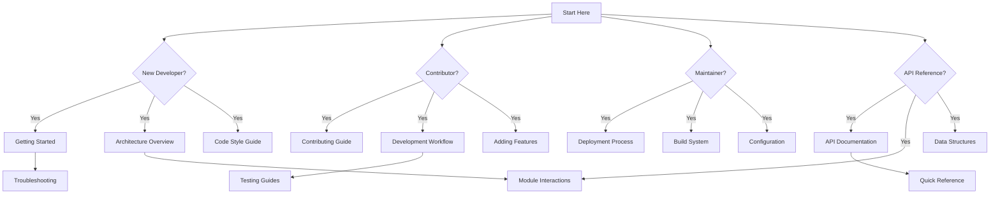

# Sum Tile Documentation

Welcome to the Sum Tile documentation! This directory contains comprehensive documentation for developers, contributors, and maintainers.

## Navigation Map

## Learning Paths

### 🎓 For New Developers

**Goal**: Get up and running quickly

1. **[Getting Started](./development/getting-started.md)** - Set up your development environment
2. **[Architecture Overview](./architecture/overview.md)** - Understand the system design
3. **[Code Style Guide](./development/code-style.md)** - Learn coding standards
4. **[Development Workflow](./development/workflow.md)** - Daily development practices
5. **[API Documentation](./api/)** - Reference for modules you'll use

**Quick Help**: [Troubleshooting](./TROUBLESHOOTING.md) | [Quick Reference](./QUICK_REFERENCE.md)

### 🤝 For Contributors

**Goal**: Contribute effectively

1. **[Contributing Guide](../CONTRIBUTING.md)** - How to contribute
2. **[Code Style Guide](./development/code-style.md)** - Coding standards
3. **[Adding Features](./development/adding-features.md)** - Feature development guide
4. **[Testing Guides](./testing/)** - How to write and run tests
5. **[Development Workflow](./development/workflow.md)** - Best practices

**Quick Help**: [Troubleshooting](./TROUBLESHOOTING.md) | [Glossary](./GLOSSARY.md)

### 🔧 For Maintainers

**Goal**: Deploy and maintain the project

1. **[Deployment Process](./deployment/process.md)** - How to deploy
2. **[Build System](./architecture/build-system.md)** - Build process
3. **[Configuration Files](./config/configuration-files.md)** - Config documentation
4. **[Scripts Documentation](./scripts/)** - Build and validation scripts
5. **[Troubleshooting](./TROUBLESHOOTING.md)** - Common issues

**Quick Help**: [Quick Reference](./QUICK_REFERENCE.md) | [Architecture](./architecture/)

### 📚 For API Users

**Goal**: Use the codebase as a library or reference

1. **[API Documentation](./api/)** - Module API reference
2. **[Module Interactions](./architecture/module-interactions.md)** - How modules work together
3. **[Data Structures](./architecture/data-structures.md)** - Data format specifications
4. **[Architecture Overview](./architecture/overview.md)** - System design

**Quick Help**: [Glossary](./GLOSSARY.md) | [Quick Reference](./QUICK_REFERENCE.md)

## Documentation Structure

### [Architecture](./architecture/)
System architecture and design documentation.

- **[Overview](./architecture/overview.md)**: High-level system architecture
- **[Module Interactions](./architecture/module-interactions.md)**: How modules interact with each other
- **[Data Structures](./architecture/data-structures.md)**: Data structures and formats
- **[Build System](./architecture/build-system.md)**: Build process and tools

### [Development](./development/)
Development guides and workflows.

- **[Getting Started](./development/getting-started.md)**: Setup and installation guide
- **[Workflow](./development/workflow.md)**: Development workflow and best practices
- **[Code Style](./development/code-style.md)**: Coding standards and conventions
- **[Adding Features](./development/adding-features.md)**: Guide for adding new features
- **[Puzzle Data](./development/puzzle-data.md)**: Puzzle data management guide

### [API](./api/)
API documentation for JavaScript modules.

- **[puzzle-core.js](./api/puzzle-core.md)**: Core puzzle logic (tiles, slots, DOM structure)
- **[puzzle-state.js](./api/puzzle-state.md)**: Shared state management
- **[scoring.js](./api/scoring.md)**: Score calculation and validation
- **[hints.js](./api/hints.md)**: Hint system implementation
- **[completion.js](./api/completion.md)**: Puzzle completion tracking
- **[modals.js](./api/modals.md)**: Modal dialog management
- **[utils.js](./api/utils.md)**: Utility functions

*Additional API documentation available in source files with JSDoc comments.*

### [Scripts](./scripts/)
Scripts documentation.

- **[Build Scripts](./scripts/build-scripts.md)**: Build and encoding scripts
- **[Validation Scripts](./scripts/validation-scripts.md)**: Puzzle data validation scripts

### [Testing](./testing/)
Testing documentation.

- **[Overview](./testing/overview.md)**: Testing strategy and structure
- **[Unit Testing](./testing/unit-testing.md)**: Guide for writing unit tests
- **[Integration Testing](./testing/integration-testing.md)**: Guide for integration tests
- **[E2E Testing](./testing/e2e-testing.md)**: Guide for E2E tests
- **[Test Utilities](./testing/test-utilities.md)**: Test helpers and utilities

### [Deployment](./deployment/)
Deployment documentation.

- **[Process](./deployment/process.md)**: Deployment process and checklist

### [Configuration](./config/)
Configuration files documentation.

- **[Configuration Files](./config/configuration-files.md)**: All configuration files explained

## Quick Links

- **[Main README](../README.md)**: Project overview and quick start
- **[Quick Reference](./QUICK_REFERENCE.md)**: Common commands and tasks ⚡
- **[Troubleshooting](./TROUBLESHOOTING.md)**: Common issues and solutions 🔧
- **[Glossary](./GLOSSARY.md)**: Technical terms and concepts 📖
- **[Contributing Guide](../CONTRIBUTING.md)**: How to contribute to the project

## Finding Information

### Using Your Editor
Most editors support search across files:
- **VS Code**: `Cmd+Shift+F` (Mac) / `Ctrl+Shift+F` (Windows)
- Search for function names, concepts, or keywords

### Using GitHub
- Use GitHub's file finder: Press `t` in repository view
- Use GitHub search: Search box at top of repository

## Getting Started

New to the project? Start here:

1. **[Getting Started Guide](./development/getting-started.md)**: Set up your development environment
2. **[Architecture Overview](./architecture/overview.md)**: Understand the system design
3. **[Code Style Guide](./development/code-style.md)**: Learn the coding standards

## For Developers

- **[Development Workflow](./development/workflow.md)**: Daily development practices
- **[Adding Features](./development/adding-features.md)**: How to add new features
- **[API Documentation](./api/)**: Reference for all modules

## Documentation Status

### ✅ Completed

- Architecture documentation (overview, module interactions, data structures, build system)
- Development guides (getting started, workflow, code style, adding features, puzzle data)
- Core API documentation (puzzle-core, puzzle-state, scoring, hints, completion, modals, utils)
- Testing documentation (overview, unit, integration, E2E, utilities)
- Scripts documentation (build scripts, validation scripts)
- Deployment documentation (process)
- Configuration documentation (all config files)
- Contributing guide
- Troubleshooting guide
- Quick reference guide
- Glossary
- Cross-references in all API docs

### 📋 Planned

- Additional API documentation (remaining modules: archive, ui, feedback, etc.)
- User documentation
- Internal documentation (decision records)

**Note**: Visual diagrams (Mermaid) have been added to architecture docs and are now complete.

## Contributing to Documentation

Found an error or want to improve the documentation?

1. Check existing issues
2. Make your changes
3. Submit a pull request

See [Contributing Guide](../CONTRIBUTING.md) for details.

## Questions?

- Check the [Main README](../README.md)
- Review the [Architecture Overview](./architecture/overview.md)
- Open an issue for questions

---

## Documentation Meta

*For maintainers:*

- **[Changelog](./CHANGELOG.md)**: Documentation change history
