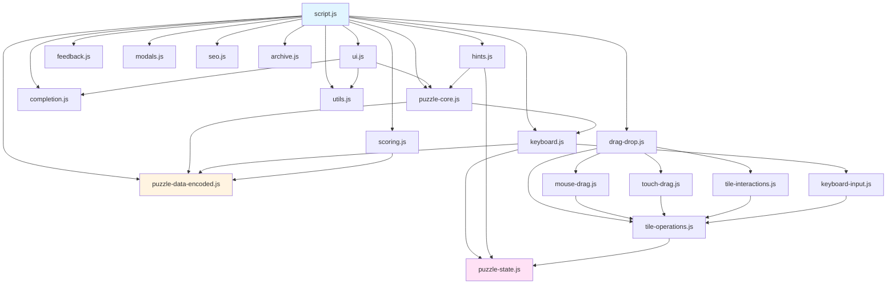

# Module Interactions

This document describes how modules interact with each other in the Sum Tile application.

## Module Dependency Graph

```
script.js (entry point)
├── puzzle-data-encoded.js (data)
├── ui.js
│   ├── puzzle-core.js
│   ├── completion.js
│   └── utils.js
├── puzzle-core.js
│   ├── puzzle-data-encoded.js
│   └── keyboard.js
├── drag-drop.js (re-exports)
│   ├── mouse-drag.js
│   ├── touch-drag.js
│   ├── tile-interactions.js
│   └── tile-operations.js
├── keyboard.js
│   ├── puzzle-state.js
│   ├── keyboard-input.js
│   └── puzzle-data-encoded.js
├── scoring.js
│   └── puzzle-data-encoded.js
├── hints.js
│   └── puzzle-state.js
├── feedback.js
├── modals.js
├── seo.js
├── archive.js
├── completion.js
└── utils.js
```

### Visual Dependency Diagram



## Key Interactions

### Puzzle Initialization

**Modules**: `script.js` → `ui.js` → `puzzle-core.js`

1. `script.js` calls `initPuzzleWithPrefix()`
2. `puzzle-core.js` creates DOM structure via `createPuzzleDOMStructure()`
3. `puzzle-core.js` creates tiles and slots via `createTile()` and `createSlot()`
4. Event handlers from `drag-drop.js` and `keyboard.js` are attached

### Drag and Drop

**Modules**: `drag-drop.js` → `mouse-drag.js` / `touch-drag.js` → `tile-operations.js` → `scoring.js`

1. User initiates drag (mouse or touch)
2. `mouse-drag.js` or `touch-drag.js` handles drag events
3. `tile-operations.js` performs actual tile placement/removal
4. `scoring.js` updates score display after placement

### Keyboard Navigation

**Modules**: `keyboard.js` → `keyboard-input.js` → `tile-operations.js` → `puzzle-state.js`

1. User presses keyboard key on tile or slot
2. `keyboard.js` delegates to `keyboard-input.js`
3. `keyboard-input.js` uses context from `puzzle-state.js`
4. `tile-operations.js` performs tile placement
5. `puzzle-state.js` tracks selected tile

### Solution Validation

**Modules**: `scoring.js` → `puzzle-data-encoded.js` → `feedback.js` → `modals.js` → `completion.js`

1. User clicks Submit button
2. `scoring.js` collects tiles from slots
3. `puzzle-data-encoded.js` validates solution
4. If valid: `feedback.js` triggers confetti, `modals.js` shows success modal
5. `completion.js` marks puzzle as completed in localStorage

### Hint System

**Modules**: `hints.js` → `puzzle-state.js` → `puzzle-core.js`

1. User clicks Hint button
2. `hints.js` checks hints remaining via `puzzle-state.js`
3. `hints.js` reveals hint (letter or position)
4. `puzzle-state.js` decrements hints remaining
5. `puzzle-core.js` updates tile/slot display

### State Management

**Modules**: `puzzle-state.js` (shared state)

- **Dragged Tile**: Managed by `puzzle-state.js`, accessed by drag handlers
- **Selected Tile**: Managed by `puzzle-state.js`, accessed by keyboard handlers
- **Hints Remaining**: Managed by `puzzle-state.js`, accessed by `hints.js`
- **Solution Shown**: Managed by `puzzle-state.js`, accessed by `hints.js`

### Completion Tracking

**Modules**: `completion.js` (localStorage) → `ui.js` → `archive.js`

1. Puzzle completed → `completion.js` saves to localStorage
2. `ui.js` checks completion status for calendar display
3. `archive.js` checks completion status for archive display

## Communication Patterns

### 1. Direct Function Calls

Most common pattern. Modules import and call functions directly.

```javascript
// scoring.js
import { calculateWordScore } from '../puzzle-data-encoded.js';
const score = calculateWordScore(word);
```

### 2. Callback Functions

Used for event handlers and async operations.

```javascript
// script.js
checkSolution(day, showErrorModal, showSuccessModal, triggerConfetti);
```

### 3. Context Objects

Used to pass configuration and state between modules.

```javascript
// keyboard-input.js
const context = {
    placeTileCallback,
    removeTileCallback,
    prefix
};
initKeyboardInput(context);
```

### 4. State Manager Pattern

Used for shared state with prefix-based isolation.

```javascript
// puzzle-state.js
const stateManager = createStateManager('archive-');
stateManager.setHintsRemaining(3);
```

### 5. DOM as State

Current puzzle state is reflected in the DOM (tiles in slots).

```javascript
// scoring.js
const word1 = Array.from(word1Slots)
    .map(slot => slot.querySelector('.tile')?.getAttribute('data-letter'))
    .join('');
```

## Prefix-Based Isolation

Multiple puzzle instances can coexist using prefixes:

- **Element IDs**: `${prefix}tiles-container`, `${prefix}word-slots`
- **State Management**: `createStateManager(prefix)` returns isolated state
- **Event Handlers**: Handlers use prefix to find correct elements

Example:
```javascript
// Daily puzzle
initPuzzleWithPrefix(day, 'daily-', createStateManager('daily-'));

// Archive puzzle
initPuzzleWithPrefix(day, 'archive-', createStateManager('archive-'));
```

## Event Flow

### Mouse Drag Flow

```
mousedown → handleDragStart (mouse-drag.js)
    ↓
drag → handleDragOver (mouse-drag.js)
    ↓
drop → handleDrop (mouse-drag.js)
    ↓
placeTileInSlot (tile-operations.js)
    ↓
updateScoreDisplay (scoring.js)
```

### Touch Drag Flow

```
touchstart → handleTouchStart (touch-drag.js)
    ↓
touchmove → handleTouchMove (touch-drag.js)
    ↓
touchend → handleTouchEnd (touch-drag.js)
    ↓
placeTileInSlot (tile-operations.js)
    ↓
updateScoreDisplay (scoring.js)
```

### Keyboard Navigation Flow

```
keydown → handleTileKeyDown (keyboard.js)
    ↓
handleTileKeyDownInput (keyboard-input.js)
    ↓
selectTile (keyboard.js)
    ↓
[User tabs to slot]
    ↓
keydown → handleSlotKeyDown (keyboard.js)
    ↓
handleSlotKeyDownInput (keyboard-input.js)
    ↓
placeTileInSlot (tile-operations.js)
    ↓
updateScoreDisplay (scoring.js)
```

## Module Responsibilities

| Module | Primary Responsibility | Dependencies |
|--------|----------------------|--------------|
| `script.js` | Orchestration, entry point | All modules |
| `puzzle-core.js` | DOM element creation | `puzzle-data-encoded.js`, `keyboard.js` |
| `puzzle-state.js` | Shared state management | None |
| `drag-drop.js` | Re-exports drag handlers | `mouse-drag.js`, `touch-drag.js`, `tile-interactions.js`, `tile-operations.js` |
| `mouse-drag.js` | Mouse drag events | `tile-operations.js`, `puzzle-state.js` |
| `touch-drag.js` | Touch drag events | `tile-operations.js`, `puzzle-state.js` |
| `tile-interactions.js` | Click handlers | `tile-operations.js` |
| `tile-operations.js` | Tile placement/removal | `puzzle-state.js` |
| `keyboard.js` | Keyboard navigation | `keyboard-input.js`, `puzzle-state.js` |
| `keyboard-input.js` | Keyboard input handling | `tile-operations.js` |
| `scoring.js` | Score calculation, validation | `puzzle-data-encoded.js` |
| `hints.js` | Hint system | `puzzle-state.js`, `puzzle-core.js` |
| `ui.js` | UI initialization | `puzzle-core.js`, `completion.js`, `utils.js` |
| `completion.js` | Completion tracking | None (localStorage) |
| `modals.js` | Modal dialogs | None |
| `feedback.js` | User feedback | None |
| `archive.js` | Archive page | `completion.js` |
| `utils.js` | Utility functions | None |

## See Also

- [Architecture Overview](./overview.md) - High-level system design
- [Data Structures](./data-structures.md) - Data format details
- [API Documentation](../api/) - Module API reference
- [Development Workflow](../development/workflow.md) - Development practices
