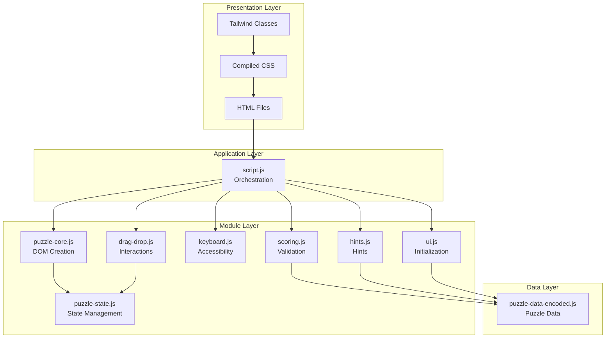
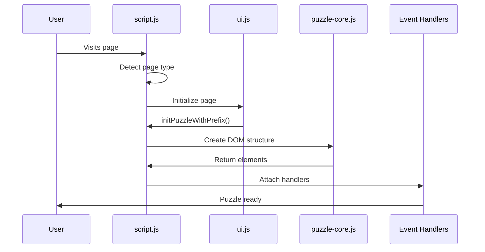
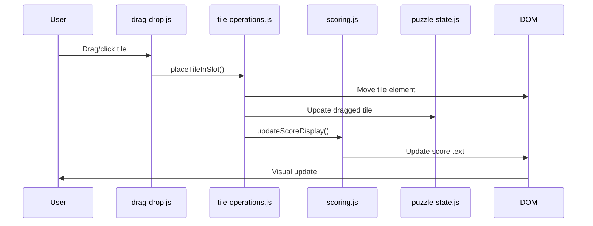
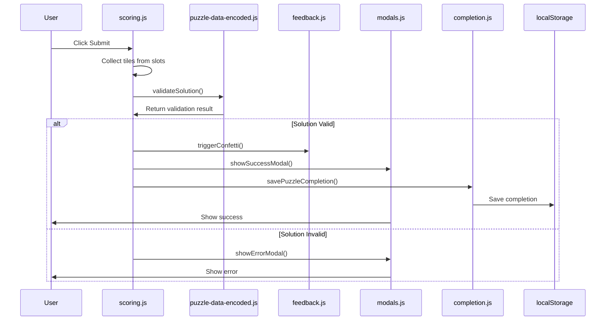

# System Architecture Overview

## High-Level Architecture

Sum Tile is a client-side web application built with vanilla JavaScript using ES6 modules. The architecture follows a modular pattern where each module has a single, focused responsibility.

## Core Principles

1. **Modular Design**: Each JavaScript module handles a specific aspect of functionality
2. **Separation of Concerns**: UI, logic, state, and data are separated into different modules
3. **Event-Driven**: Communication between modules happens through events and callbacks
4. **Prefix-Based Isolation**: Multiple puzzle instances can coexist using element ID prefixes

## Architecture Layers

```
┌─────────────────────────────────────────┐
│         Presentation Layer              │
│  (HTML, CSS, Tailwind, UI Components)   │
└─────────────────────────────────────────┘
                    ↓
┌─────────────────────────────────────────┐
│         Application Layer                │
│  (script.js - Module Orchestration)     │
└─────────────────────────────────────────┘
                    ↓
┌─────────────────────────────────────────┐
│         Module Layer                    │
│  (js/*.js - Feature Modules)            │
│  - puzzle-core.js (DOM creation)        │
│  - drag-drop.js (interactions)           │
│  - keyboard.js (accessibility)          │
│  - scoring.js (validation)               │
│  - hints.js (hint system)               │
│  - ui.js (initialization)                │
│  - etc.                                  │
└─────────────────────────────────────────┘
                    ↓
┌─────────────────────────────────────────┐
│         Data Layer                      │
│  (puzzle-data-encoded.js)               │
│  - Puzzle definitions                    │
│  - Validation functions                  │
│  - Score calculations                    │
└─────────────────────────────────────────┘
```

### Visual Architecture Diagram



## Module Categories

### Core Modules
- **`puzzle-core.js`**: Creates DOM elements (tiles, slots, puzzle structure)
- **`puzzle-state.js`**: Manages shared state (dragged tile, selected tile, hints, solution shown)

### Interaction Modules
- **`drag-drop.js`**: Re-exports mouse and touch drag handlers
- **`mouse-drag.js`**: Mouse-based drag and drop
- **`touch-drag.js`**: Touch-based drag and drop
- **`tile-interactions.js`**: Click handlers for tiles and slots
- **`tile-operations.js`**: Core tile placement/removal operations
- **`interaction-state.js`**: Tracks interaction state

### Accessibility Modules
- **`keyboard.js`**: Keyboard navigation and accessibility
- **`keyboard-input.js`**: Keyboard input handling and context management

### Game Logic Modules
- **`scoring.js`**: Score calculation and solution validation
- **`hints.js`**: Hint system implementation
- **`completion.js`**: Puzzle completion tracking (localStorage)
- **`streak.js`**: Streak calculation

### UI Modules
- **`ui.js`**: UI initialization (calendar, daily puzzle, countdown)
- **`modals.js`**: Modal dialogs (help, success, error)
- **`feedback.js`**: User feedback and animations
- **`archive.js`**: Archive page functionality
- **`auto-complete.js`**: Auto-complete functionality
- **`seo.js`**: Dynamic SEO meta tag updates

### Utility Modules
- **`utils.js`**: Shared utility functions

## Entry Point

**`script.js`** is the main entry point that:
1. Imports puzzle data (must be first)
2. Imports all feature modules
3. Defines shared initialization functions
4. Sets up event listeners for different pages
5. Coordinates module interactions

## Data Flow

### Puzzle Initialization Flow

```
User visits page
    ↓
script.js detects page type
    ↓
ui.js initializes page (calendar/daily/archive)
    ↓
initPuzzleWithPrefix() called
    ↓
puzzle-core.js creates DOM structure
    ↓
Event handlers attached (drag-drop, keyboard, etc.)
    ↓
Puzzle ready for interaction
```

#### Visual Flow Diagram



### Tile Movement Flow

```
User drags/clicks tile
    ↓
drag-drop.js or tile-interactions.js handles event
    ↓
tile-operations.js performs placement/removal
    ↓
scoring.js updates score display
    ↓
puzzle-state.js updates state
    ↓
UI reflects changes
```

#### Visual Flow Diagram



### Solution Validation Flow

```
User clicks Submit
    ↓
scoring.js collects tiles from slots
    ↓
puzzle-data-encoded.js validates solution
    ↓
If valid: feedback.js shows success, modals.js shows modal
    ↓
completion.js marks puzzle as completed
    ↓
LocalStorage updated
```

#### Visual Flow Diagram



## State Management

State is managed in several ways:

1. **Module-Level State**: Each module manages its own internal state
2. **Shared State**: `puzzle-state.js` manages cross-module state (dragged tile, hints, etc.)
3. **DOM State**: Current puzzle state is reflected in the DOM (tiles in slots)
4. **Persistent State**: `completion.js` uses localStorage for completion tracking

## Prefix System

The application supports multiple puzzle instances on the same page using prefixes:

- **No prefix (`''`)**: Regular puzzle page
- **`'daily-'`**: Daily puzzle on homepage
- **`'archive-'`**: Archive puzzle

Each prefix creates isolated:
- Element IDs (`${prefix}tiles-container`)
- State management (via `createStateManager()`)
- Event handlers

## Build System

1. **CSS Build**: PostCSS compiles Tailwind from `src/styles.css` to `styles.css`
2. **Data Build**: `scripts/encode-puzzle-data.js` encodes puzzle data from `puzzle-data.js` to `puzzle-data-encoded.js`

## Browser Compatibility

- Modern browsers with ES6 module support
- No polyfills required
- Uses standard Web APIs (Drag & Drop, Touch Events, localStorage)

## See Also

- [Module Interactions](./module-interactions.md) - Detailed module communication patterns
- [Data Structures](./data-structures.md) - Data format specifications
- [Build System](./build-system.md) - Build process and tools
- [API Documentation](../api/) - Module API reference
